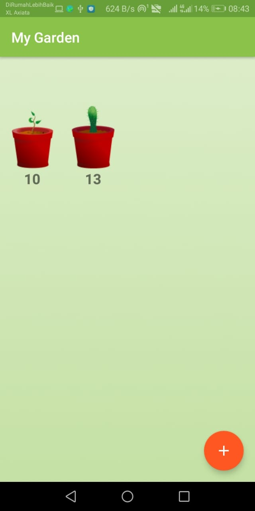
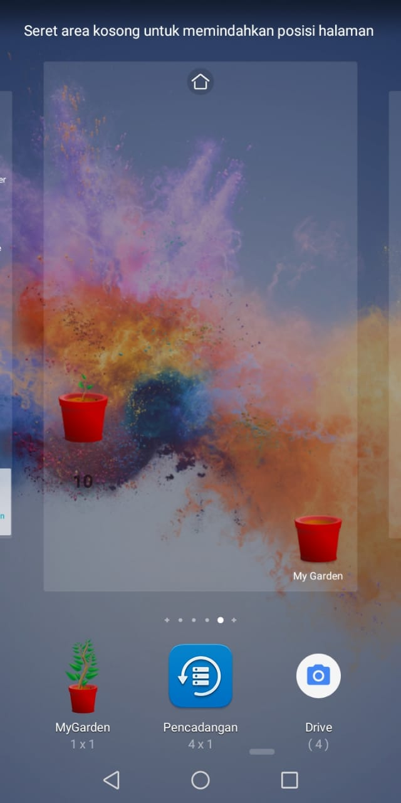
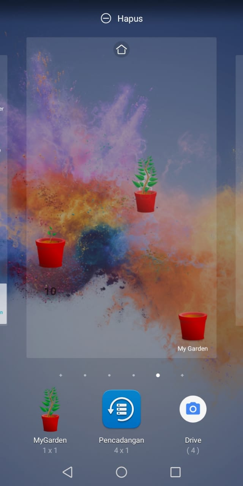
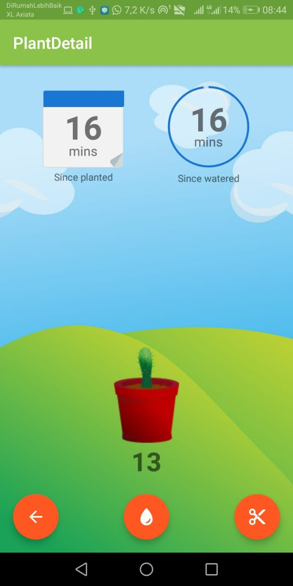
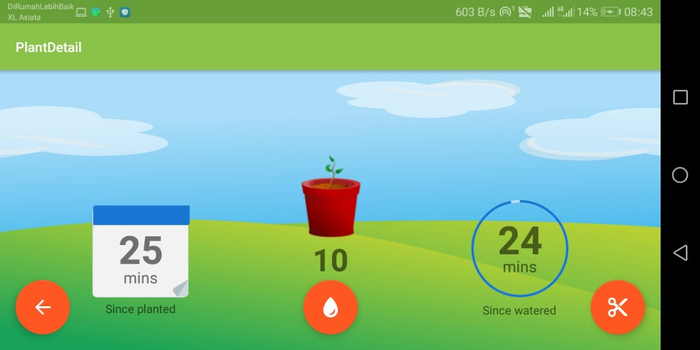

# App Widgets Plant

## PENGERTIAN WIDGETS

> Widget adalah sebuah “perwakilan” dari aplikasi yang memungkinkan pengguna untuk dapat menggunakan fitur dari aplikasi yang diwakilkan tersebut secara langsung tanpa harus membuka aplikasi “sesungguhnya”. Biasanya widget terletak pada home screen atau tampilan awal layar perangkat Android anda.ng berjalan dengan dinamis. Node.js dibuat berdasarkan runtime Javascript, dan dapat dijalankan oleh berbagai  macam sistem operasi. Node.js pun memiliki banyak pustaka HTTP yang dapat membuat menjalankan server tanpa program server web seperti Apache, dan lain-lain.

#
## REPOSITORYES INI DARI UDACITY
### link berikut
- [x] Buka Situs Udacity di sini  [Klik Disini ](https://classroom.udacity.com/courses/ud855/lessons/f133dd92-8e3c-40b9-9d9d-545498638459/concepts/98627458-72ac-45a0-94ff-bca60428ccfc).
- [x] Ikuti video tutorialnya

## Screenshots 
> Ini adalah tampilan awal aplikasi kita dapat menambahkan tanaman yang nantinya akan kita siram di setiap waktunya
> 
> 
 
## Screenshots 
> Setelah itu kita dapat menampilkan tanaman yang sudah kita tambahkan tadi di hp kita dengan menggunakan fitur Widget 
> 
> 
 
## Screenshots 
> Cara menembahkanya tekan layar sekitar 5detik kemudian pilih opsi widget dan cari app mygarden
> 
> 

## Screenshots 
> Tampilan dari fitur detail tanaman terdapat umur tanaman dan water meter 
> 
> 
 
## Screenshots 
> Tampilan landscape
> 
> 
 

## Catatan
### Mungkin pada tutorial udacity dependency nya berbeda dengan android studio update saat ini maka
- [x] anda dapat mengubahnya menjadi androidx 
- [x] atau dapat gunakan repository ini untuh bahan belajar 

#Terima Kasih

## Resources gambar
### link berikut
- [x] sapling-plant-growing-seedling  [Klik Disini ](https://pixabay.com/en/sapling-plant-growing-seedling-154734/).
- [x] cactus-cacti-plant-thorns-spiky  [Klik Disini ](https://pixabay.com/en/cactus-cacti-plant-thorns-spiky-152378/).
- [x] the-background-background-design  [Klik Disini ](https://pixabay.com/en/the-background-background-design-352165/).
